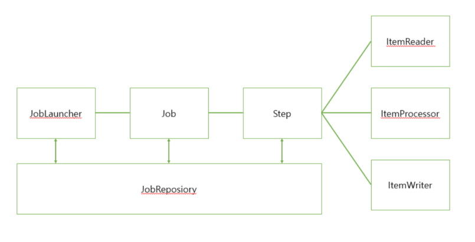

## spring batch

## 왜 spring batch 인가?

* 효과적인 로깅, 통계 처리, 트랜잭션 관리 등 재사용 가능한 필수 기능을 지원한다.
* 수동으로 처리하지 않도록 자동화되어 있다.
* 예외사항과 비정상 동작에 대한 방어 기능이 있다.
* 스프링 부트 배치의 반복되는 작업 프로세스를 이해하면 비즈니스 로직에 집중 할 수 있다.

### standardize process flow위한 기능

#### Tasket model
* 간단한 process에 사용

#### Chunk model
* 대량의 데이터를 효율적으로 처리
* 고정 된 양의 데이터를 일괄 적으로 read / process / writer 하는 방법

### 다양한 데이터 형식의 I / O
* 파일, 데이터베이스, 메시지 큐 등과 같은 다양한 데이터 리소스에 대한 입출력을 쉽게 수행 할 수 있습니다.

### 효율적인 처리
* 설정에 따라 다중 실행, 병렬 실행, 조건 분기가 수행됩니다.

### 작업 실행 제어
* 데이터 레코드를 표준으로 사용하여 영구 실행, 재시작 작업을 수행 할 수 있습니다.

### spring batch 주의 사항

### spring batch의 기본 구조

* Job과 Step 1:M
* Step과 ItemReader, ItemProcessor, ItemWriter 1:1

#### 용어 정리
`Job` 
* Spring Batch의 배치 애플리케이션을위한 일련의 프로세스를 요약하는 단일 실행 단위입니다

`Step` 
* Job을 구성하는 처리 단위입니다. 하나의 작업은 1 ~ N 개의 단계를 포함
* 단계는 청크 모델 또는 태스크 모델 (나중에 설명)에 의해 구현됩니다.

`JobLauncher` 
* 작업 실행을위한 인터페이스입니다.

`JobRepository` 
* Job 및 Step의 상태를 관리하는 시스템입니다. 
관리 정보는 Spring Batch에서 지정한 테이블 스키마를 기반으로 데이터베이스에 유지됩니다.

https://terasoluna-batch.github.io/guideline/5.0.1.RELEASE/en/Ch02_SpringBatchArchitecture.html#Ch02_SpringBatchArch_Overview